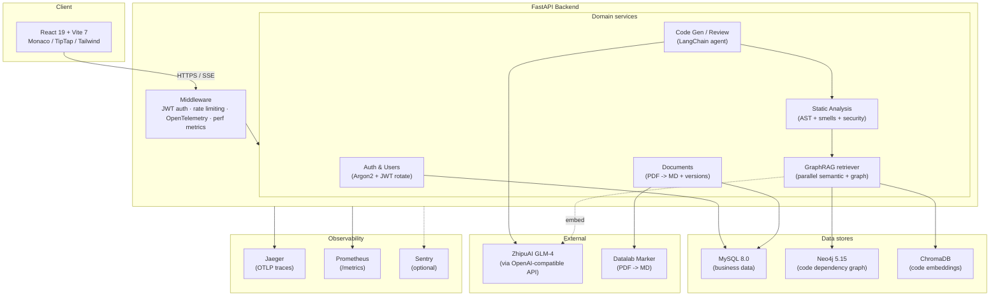

# Smart Code Assistant

[](https://github.com/WeiGuang-2099/Smart_Code_Assistant/actions/workflows/ci.yml)
[](./backend-fastapi/htmlcov)
[](https://www.python.org/)
[](https://react.dev/)
[](./LICENSE)

An AI-powered code generation, review, and analysis platform built with FastAPI, React, and LangChain. Combines LLM-driven code intelligence with a code knowledge graph (GraphRAG) for deep structural understanding of your codebase.

## Features

### AI Code Intelligence
- **Code Generation** - Generate code from natural language descriptions using ZhipuAI GLM-4 models
- **Code Review** - Automated code review with scoring, issue detection, and improvement suggestions
- **AI Chat** - Multi-turn conversational assistant for code-related questions with context history
- **Streaming Responses** - Real-time SSE streaming for AI responses with heartbeat and tool events

### LangChain Agent System
- Configurable AI agents ("digital humans") with custom domains and system prompts
- Agents invoke multiple code analysis tools in parallel (structure, smells, complexity, security)
- Persistent conversation history with token tracking and summarization
- Agent lifecycle management: draft, active, inactive, and training states

### Code Knowledge Graph (GraphRAG)
- AST-based code parsing and entity extraction (functions, classes, imports, variables)
- Neo4j-powered dependency graph with relationship types: CALLS, IMPORTS, INHERITS, CONTAINS
- Hybrid retrieval: parallel ChromaDB semantic search + Neo4j graph traversal
- Dependency analysis, impact analysis, path finding, and semantic code search

### Code Analysis
- Structure analysis (line counts, functions, classes, imports)
- Code smell detection
- Cyclomatic complexity calculation
- Security vulnerability scanning
- Run analyses individually or combined

### Document Management
- Full document CRUD with categories and project association
- Version control with change tracking and diff viewing
- PDF-to-Markdown conversion via Datalab Marker API
- Rich text editing with TipTap (images, links, code blocks)

### Project & Code File Management
- User-owned projects with code file organization
- Monaco Editor integration with syntax highlighting
- Multi-language support

## Tech Stack

| Layer | Technology |
|-------|-----------|
| Frontend | React 19, TypeScript, Vite 7, Tailwind CSS 4 |
| Backend | Python, FastAPI, SQLAlchemy 2.0 (async), Alembic |
| AI/LLM | LangChain, ZhipuAI GLM-4 / OpenAI (switchable provider); LangGraph agent rewrite planned |
| Relational DB | MySQL 8.0 (via aiomysql) |
| Graph DB | Neo4j 5.15 (code knowledge graph) |
| Vector DB | ChromaDB (semantic search) |
| Auth | JWT (access + refresh tokens), Argon2 password hashing |
| Observability | OpenTelemetry, Jaeger, Prometheus metrics, Sentry (optional) |
| Testing | pytest + pytest-cov (backend, 60%+ coverage), Vitest + RTL (frontend), k6 (HTTP load) |
| Deployment | Docker Compose, GitHub Actions CI |

## Architecture



### Key flows

- **Streaming chat** — `POST /api/v1/agent/chat/stream` returns a typed SSE stream (`metadata` -> `content`* -> `tool_*` -> `done`) with heartbeat events and session-scoped metrics.
- **Hybrid GraphRAG retrieval** — `CodeGraphRetriever.retrieve()` fans out a ChromaDB semantic query and a Neo4j subgraph traversal in parallel via `asyncio.gather`, then caches the merged result in the L1 LRU layer.
- **Layered cache** — `CacheManager` is L1 (in-process LRU with TTL + LRU eviction) with an optional L2 Redis backend gated by `REDIS_URL`. The `@cached` decorator keys on stable hashes of the call arguments.
- **Token revocation** — Logout pushes the token onto a deterministic-keyed in-memory blacklist; `revoke_all_user_tokens` bumps a per-user token version so every previously issued token fails decode without DB hit.

## Performance

Numbers from `python scripts/benchmark.py` on a developer laptop (no real Neo4j / ChromaDB / LLM - external stores mocked). All hot paths sit comfortably in the low-millisecond range so the request budget is dominated by the LLM call, not local orchestration.

| Hot path | avg | p50 | p95 |
|---|---:|---:|---:|
| Static analysis pipeline (4 tools) | 1.4 ms | 1.3 ms | 2.8 ms |
| GraphRAG retrieval (semantic + graph in parallel) | 0.6 ms | 0.5 ms | 0.9 ms |
| Conversation compression (100-message history) | 0.01 ms | 0.01 ms | 0.02 ms |
| AST parsing (260 lines of Python) | 2.1 ms | 2.1 ms | 2.2 ms |
| LRU cache (1000 sequential GETs) | 0.5 ms | 0.5 ms | 0.5 ms |

Re-run anytime with:

```bash
cd backend-fastapi
python scripts/benchmark.py
```

For HTTP-level load testing see [`load-tests/README.md`](./load-tests/README.md) (k6 scenarios with built-in latency/error-rate thresholds).

## Evaluation

The repo ships a runnable eval harness (`evals/`) that measures the GraphRAG pipeline against a hand-written golden set of 50 questions about this codebase. Retrieval is scored automatically against expected files and graph neighbors; generation is scored by an LLM-as-judge using two reference-free metrics (faithfulness to the retrieved context, and answer relevance to the question). The numbers below are a real run against live Neo4j and ChromaDB, not mocked.

### Retrieval (golden set, n=50, 0 errors)

Before is the pre-traversal regex graph path (git `0d297e4`, 2026-06-18); after is real graph-neighbor traversal seeded from the top semantic hits, plus import-name indexing and the module-level CALLS fix (2026-06-20), re-indexed against live Neo4j and ChromaDB.

| Metric | Before (2026-06-18) | After (2026-06-20) |
|---|---:|---:|
| hit_rate@1 | 0.42 | 0.44 |
| hit_rate@5 | 0.60 | 0.64 |
| recall@5 | 0.50 | 0.52 |
| mrr | 0.50 | 0.53 |
| hybrid_hit_rate@5 | 0.60 | 0.64 |
| graph_neighbor_recall | 0.10 | 0.29 |
| graph_traversal_correctness | 0.08 | 0.24 |

graph_neighbor_recall nearly tripled (0.10 -> 0.29) and graph_traversal_correctness tripled (0.08 -> 0.24): the graph branch now walks real CALLS / inheritance / import edges from the semantic seeds instead of regex-matching entity names out of the question. Semantic-retrieval metrics moved only slightly (a re-indexing effect), since this work targets the graph branch.

### Generation (GLM-5.2 generator, GLM-5.1 judge, prompt v1, n=50, 2026-06-20)

| Metric | Mean (1-5) | Share >= 4 |
|---|---:|---:|
| faithfulness | 4.76 | 92% |
| answer_relevance | 3.66 | 56% |

Faithfulness is high (answers stay grounded in the retrieved context); answer relevance is the weaker axis, which tracks the retrieval gaps below. Upgrading the generator to GLM-5.2 and the judge to GLM-5.1 (kept on different models to avoid self-grading bias) lifted faithfulness 4.64 -> 4.76 and answer_relevance 3.48 -> 3.66 over the 2026-06-18 GLM-4 / GLM-4-plus baseline. The run had 0 generation errors and 0 judge parse failures.

### By category

All columns are the 2026-06-20 run (retrieval re-indexed; generation with GLM-5.2 / GLM-5.1).

| Category | n | hit_rate@5 | recall@5 | mrr | faithfulness | answer_relevance |
|---|---:|---:|---:|---:|---:|---:|
| definition_lookup | 12 | 0.50 | 0.50 | 0.47 | 4.67 | 4.33 |
| feature_lookup | 12 | 0.75 | 0.75 | 0.63 | 5.00 | 2.17 |
| dependency_trace | 10 | 0.40 | 0.35 | 0.29 | 5.00 | 3.90 |
| impact_analysis | 8 | 1.00 | 0.54 | 0.78 | 5.00 | 4.25 |
| cross_file_flow | 8 | 0.63 | 0.42 | 0.50 | 4.00 | 4.00 |

The breakdown is the point of the harness: `impact_analysis` retrieves cleanly (hit_rate@5 1.00), while `dependency_trace` is the weakest on retrieval (recall@5 0.35), and `feature_lookup` has the lowest answer_relevance (2.17) despite strong retrieval -- a grounding gap, not a retrieval one. Graph-neighbor metrics rose sharply after the traversal rework (graph_neighbor_recall 0.10 -> 0.29, graph_traversal_correctness 0.08 -> 0.24), and the harness then localized the remaining ceiling precisely: for "how does X work" questions the embedding model often ranks schema/exception classes (e.g. `UserRegister`, `TokenVersionManager`) above the endpoint or service function whose call/import neighbors actually answer the question, so the graph traversal seeds from the wrong nodes. That seed-selection problem -- not the graph itself -- is the dominant remaining lever, and is the explicit target of the Phase 2 hybrid-search / reranking work.

**Known limitations.**
- *Seeding dominates the graph-neighbor ceiling.* Traversal is seeded from the top semantic hits, so when semantic search surfaces the wrong node type (a schema class instead of the calling function), the right neighbors are never reached even though they exist in the graph. Verified by hand: seeding `register` directly yields its `get_password_hash` / `create_token_pair` neighbors at recall ~1.0.
- *Class instantiation and same-file usage are not edges.* Neighbors reachable only through instantiation (`Neo4jClient()`, `ChromaDBClient()`) or a class defined and used in the same file (`MetricsCollector`) are not yet modeled, so those expectations stay at zero by design. Modeling instantiation/usage is the next graph iteration.
- *Eval isolation.* Graph nodes are indexed under `project_id=99999`; unlike ChromaDB collections, cross-project node isolation in Neo4j is not enforced.

Reproduce: `docker compose up -d`, index the corpus once, then run with generation:

```bash
python -m evals.run --golden evals/golden_set/backend_fastapi.jsonl --index-corpus backend-fastapi/app
python -m evals.run --golden evals/golden_set/backend_fastapi.jsonl --with-generation
```

Generation evals are opt-in (they need `ZHIPUAI_API_KEY` and cost a few GLM calls) and never run in CI; retrieval-only runs are cheap and deterministic. The eval index is isolated under `project_id=99999` in ChromaDB so it never mixes with dev data. By default the generator and judge are the same model family (GLM); the switchable provider abstraction (`LLM_PROVIDER=openai`) allows re-judging with a disjoint family as a cross-check.

## Getting Started

### Prerequisites

- Docker and Docker Compose
- Python 3.11+
- Node.js 18+
- ZhipuAI API key

### 1. Clone the Repository

```bash
git clone https://github.com/your-username/Smart_Code_Assistant.git
cd Smart_Code_Assistant
```

### 2. Start Infrastructure Services

```bash
docker compose up -d
```

This starts MySQL (port 3307), Neo4j (ports 7474, 7687), and ChromaDB (port 8001).

### 3. Configure Backend

```bash
cp backend-fastapi/.env.example backend-fastapi/.env
```

Edit `backend-fastapi/.env` and set your ZhipuAI API key and other configuration values.

### 4. Start the Backend

```bash
cd backend-fastapi
pip install -r requirements.txt
alembic upgrade head
uvicorn app.main:app --host 0.0.0.0 --port 8000 --reload
```

### 5. Start the Frontend

```bash
cd frontend
npm install
npm run dev
```

The frontend runs at `http://localhost:5173` and proxies API requests to the backend.

### 6. Default User

A demo user is seeded on first startup:

| Field | Value |
|-------|-------|
| Username | `demo` |
| Password | `demo123456` |

## API Overview

| Endpoint Group | Path Prefix | Description |
|---------------|-------------|-------------|
| Auth | `/api/v1/auth` | Login, register, token refresh |
| Projects | `/api/v1/projects` | Project CRUD |
| Code Files | `/api/v1/code-files` | Code file management |
| AI Code Gen | `/api/v1/ai` | Code generation, review, chat |
| Agent | `/api/v1/agent` | LangChain agent analysis, generation, chat |
| Agent Stream | `/api/v1/agent/chat/stream` | SSE streaming chat |
| Agents | `/api/v1/agents` | Agent CRUD, conversations, training |
| Code Analysis | `/api/v1/code-analysis` | Structure, smells, complexity, security |
| Code Graph | `/api/v1/code-graph` | Knowledge graph build and queries |
| Documents | `/api/v1/documents` | Document CRUD and PDF parsing |
| Versions | `/api/v1/versions` | Document versioning |
| Health | `/api/v1/health` | Service health check |
| Metrics | `/metrics` | Prometheus metrics |

## Configuration

### Environment Variables

Key configuration options (set in `backend-fastapi/.env`):

| Variable | Description | Default |
|----------|-------------|---------|
| `ZHIPU_API_KEY` | ZhipuAI API key | - |
| `LLM_PROVIDER` | LLM provider: `zhipuai` or `openai` | `zhipuai` |
| `LLM_API_KEY` | Provider API key (falls back to `ZHIPUAI_API_KEY`) | _(unset)_ |
| `LLM_MODEL` | Override default-tier model (else provider preset) | _(unset)_ |
| `DATABASE_URL` | MySQL connection string | `mysql+aiomysql://...` |
| `NEO4J_URI` | Neo4j Bolt URI | `bolt://localhost:7687` |
| `CHROMA_HOST` | ChromaDB host | `localhost` |
| `SECRET_KEY` | JWT signing key | - |
| `CODE_GRAPH_EMBEDDING_MODEL` | Embedding model | `BAAI/bge-small-zh-v1.5` |
| `RATE_LIMIT_GENERAL` | General rate limit | `100/minute` |
| `RATE_LIMIT_LOGIN` | Login rate limit | `20/minute` |
| `SENTRY_DSN` | Sentry DSN - error tracking disabled if blank | _(unset)_ |
| `SENTRY_TRACES_SAMPLE_RATE` | Sentry performance sampling | `0.0` |
| `VITE_SENTRY_DSN` | Frontend Sentry DSN - tracking disabled if blank | _(unset)_ |

## Project Structure

```
Smart_Code_Assistant/
├── backend-fastapi/          # Python/FastAPI backend
│   ├── app/
│   │   ├── api/              # Route handlers
│   │   ├── core/             # Config, security, middleware
│   │   ├── models/           # SQLAlchemy models
│   │   ├── schemas/          # Pydantic schemas
│   │   └── services/         # Business logic
│   │       ├── langchain_glm_service.py  # LLM integration
│   │       ├── conversation_manager.py   # Chat history management
│   │       └── code_graph/               # GraphRAG subsystem
│   ├── alembic/              # Database migrations
│   ├── tests/                # Test suite
│   └── scripts/              # Utility scripts
├── frontend/                 # React/TypeScript frontend
│   └── src/
│       ├── components/       # UI components
│       ├── contexts/         # React contexts (auth, document, toast)
│       ├── hooks/            # Custom hooks
│       ├── pages/            # Page components
│       ├── services/         # API client services
│       └── types/            # TypeScript type definitions
├── docker-compose.yml        # Infrastructure services
└── init-scripts/             # Database initialization SQL
```

## Testing

The backend has ~300 tests covering 60%+ of statements: auth, caching, rate
limiting, alerting, query analysis, code-analysis tools, AST parsing, the
GraphRAG builder, Markdown/TipTap conversion, and the optional Sentry layer.

The frontend has 54+ tests (Vitest + Testing Library) covering the auth
context, toast context, error boundary, empty-state primitives, loading
skeletons, and Sentry initialisation.

HTTP-level load testing lives under [`load-tests/`](./load-tests/) (k6
scenarios with built-in latency/error-rate thresholds).

### Run the backend tests locally

```bash
cd backend-fastapi

# install dev dependencies (includes pytest, pytest-asyncio, pytest-cov)
pip install -r requirements.txt

# run the full suite with coverage
pytest

# faster: skip the coverage instrumentation
pytest --no-cov

# generate an HTML coverage report (written to htmlcov/)
pytest --cov --cov-report=html
open htmlcov/index.html
```

### Lint the backend

```bash
cd backend-fastapi
pip install ruff
ruff check app tests
```

### Run the frontend tests locally

```bash
cd frontend
npm install

# single run, CI-style
npm test

# watch mode while developing
npm run test:watch

# generate coverage report (writes to coverage/)
npm run test:coverage
```

### HTTP load tests

```bash
# install k6 first - https://k6.io/docs/get-started/installation/

# 30s smoke test
k6 run load-tests/smoke.js

# 3-min baseline against the seeded demo user
k6 run load-tests/baseline.js
```

See [`load-tests/README.md`](./load-tests/README.md) for the full scenario
catalogue and the embedded thresholds.

### Continuous integration

Every push and pull request to `main` runs the [CI workflow](.github/workflows/ci.yml):

| Job | Steps |
|-----|-------|
| `backend` | `ruff check` -> `pytest --cov --cov-fail-under=55` -> uploads HTML report + Codecov XML |
| `frontend` | `npm ci` -> `npm run lint` -> `tsc --noEmit` -> `npm test` -> `npm run build` |

Builds fail if backend coverage drops below 55% or any lint / type / test step regresses.

## License

This project is licensed under the MIT License.
